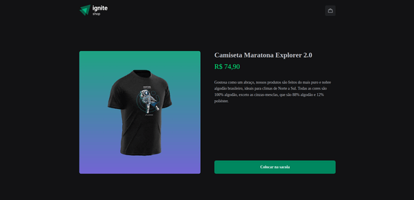

<h1 align="center">IGNITE SHOP</h1>

## Introdução

Ignite Shop é uma aplicação WEB de uma loja de camisetas. Possui uma integração com a plataforma de pagamentos da Stripe. No site do ignite Shop o cliente seleciona as camisetas disponíveis na lista adicionando-as no carrinho, confere os itens do carrinho e efetua a compra sendo redirecionado para a plataforma de pagamento da Stripe. Na plataforma do stripe o cliente preenche os dados e é  redirecionado para a página de sucesso da aplicação caso o processamento seja confirmado.

É um projeto desenvolvido no curso de Reactjs módulo 4 ministrado pela Rocketseat abordando os conceitos sobre o framework Nextjs e a bibliteca de estilização Stitches.

<div align="center" >
  
  
</div>
<div align="center" >  
  
  
</div>

## Requisitos

- Nodejs 16.20
- npm 8.19
- Nextjs 12
- Conta e credenciais na Platafoma [Stripe](https://stripe.com/br)

## Tecnologias

- [ReactJS](https://react.dev/)
- [Nextjs](https://nextjs.org/)
- [Typescript](https://www.typescriptlang.org/)
- [Stitches](https://stitches.dev/)
- [Axios](https://axios-http.com/)
- [Stripe](https://stripe.com/br)
- [keen Slider](https://keen-slider.io/)

## Instalação

```sh
# Fazer o clone do projeto em uma máquina local
git clone https://github.com/marciovz/shop-reactjs-ignite2022.git
```

```sh
# Acessa a pasta do projeto
cd shop-reactjs-ignite2022
```

```sh
# Rodar a instalação das dependências do projeto
npm install
```

## Configuração

- Copiar o arquivo .env_example renomeando-o para .env.local 
- Adicionar as credenciais do Stripe

.env.local

```sh
# App
NEXT_URL=http://localhost:3000

# PLATAFORMA PAGAMENTO STRIPE
STRIPE_PUBLIC_KEY=***Adicionar a chave pública aqui***
STRIPE_SECRET_KEY=***Adicionar a chave secreta aqui***

```

## Rodando a aplicação

```sh
# Rodar a aplicação localmente
npm run dev
```

Abrir a aplicação no navegador no endereço http://localhost:3000
